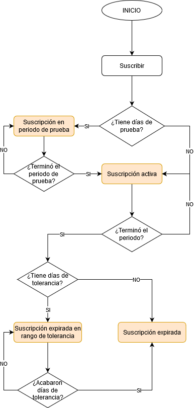
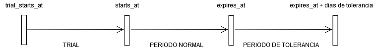

# Subscriptions

### Tipos de plan (PlanType)
Un tipo de plan engloba un conjunto de caracteristicas permitidas, puede usarse para separar multiples tipos de planes como planes para Empresa, para Usuarios, de almacenamiento, etc.

- Un tipo de plan puede estar ligado a una o más características.

### Características de plan (PlanFeature)
Las caracteristicas de plan, como su nombre lo dice, permiten definir características, permisos, etc que puede tener un tipo de plan.

- Una característica puede ser contable(`limit`) o no contable(`feature`).
- Una característica no almacena los límites que tiene sino solo su información básica.
- Una característica puede estar ligada a uno o varios tipos de plan permitiendo casos en los que distintos tipos de plan comparten una misma caracteristica.

### Planes (Plan)
Un plan pertenece a un tipo de plan y este puede tener asociados los límites de las características del tipo de plan(a través de relaciones), siempre y cuando sean carcateristicas contables(`limit`).

- Plan default: Un plan default es el plan que se obtiene por defecto al suscribir a un usuario u otra instancia, solo puede existir un plan default dentro de un mismo tipo de plan.
- Un plan pertenece solo a un tipo de plan
- Un plan puede ser `visible` o `hidden` (oculto)

### Periodos de plan (PlanPeriod)
Un periodo de plan indica el tiempo que dura un ciclo, los usuarios o instancias se suscriben directamente al periodo y no al plan dado que los periodos pueden variar en tiempo.

- Un periodo puede tener un costo o ser gratuito
- Un periodo pertenece a un solo plan
- Puede tener dias de prueba
- Puede variar en duración
    - Puede ser recurrente: Cada cierto tiempo debe renovarse(`recurring`)
    - Puede ser no recurrente: No puede renovarse
        - Puede ser limitado: Tiene definido una unidad de tiempo como Día, Mes y Año además de la cantidad de unidades de tiempo, por ejemplo **5 días**, **6 meses**, **1 año**, pasado este periodo no se vuelve a repetir, termina la suscripción. (`limited`)
        - Puede ser ilimitado: Puede no tener definido una unidad de tiempo ni cantidad de unidades, en otras palabras, **nunca caduca**. (`unlimited`)
- Un plan puede tener visibilidad `visible` o `hidden`
- Puede tener días de tolerancia para renovación.
- Puede haber solo un periodo default dento del mismo plan.

### Subscripción (PlanSubscription)
Una subscripción es una relación creada entre un usuario u otra instancia con un plan a través de un periodo, la suscripción obtiene informacion actual del plan y del periodo y la mantiene en la suscripción, parecido a crear una copia, para evitar efectos colaterales cuando cambian datos del plan, precios, etc. pudiendo definir el comportamiento cuando ocurren estas situaciones a través de la escucha de eventos.

Cuando se crea una suscripción, esta se vuelve independiente del plan y del periodo aunque es posible obtener las relaciones a dichos modelos para obtener información actualizada u otras acciones necesarias.

- La suscripción trabaja con relaciones polimórficas pudiendo tener relaciones con cualquier modelo y no solo con el de usuario.
- Mantiene la información del plan y periodo en el momento en el que se crea.
    - Días de tolerancia
    - Precio
    - Moneda
    - Periodo de recurrencia
    - Límites de features
- **Un modelo puede suscribirse solo a un periodo de plan dentro del mismo tipo** por lo que para suscribirse a un nuevo periodo del mismo tipo de plan se debe cancelar primero dicha suscripción existente. En otras palabras, solo puede existir cero o una suscripción no cancelada relacionada con el modelo.
- Dependiendo el periodo al que se suscribe, la suscripción puede variar en duración
    - Puede ser recurrente: Cada cierto tiempo debe renovarse(`recurring`)
    - Puede ser no recurrente: No puede renovarse
        - Puede ser limitado: Tiene definido una unidad de tiempo como Día, Mes y Año además de la cantidad de unidades de tiempo, por ejemplo **5 días**, **6 meses**, **1 año**, pasado este periodo no se vuelve a repetir, no se puede renovar y es cancelada. (`limited`)
        - Puede ser ilimitado: Puede no tener definido una unidad de tiempo ni cantidad de unidades, en otras palabras, **nunca caduca**. Si puede ser cancelada pero no renovada. (`unlimited`)
- Una subscripción puede tener los siguientes estatus según su validez en tiempo:
    - **Suscripción en periodo de prueba**: Suscripción que aun se encuentra en su periodo de prueba
    - **Suscripción activa**: Suscripción que se encuentra dentro del periodo normal de la suscripción.
    - **Suscripción expirada en rango de tolerancia**: Suscripción que ha expirado pero aún se encuentra en un rango de tolerancia.
    - **Suscripción expirada (Full expired)**: Suscripción que ha expirado y ya han pasado los días de tolerancia. En caso de haber renovación, esta será tomada a partir de la fecha actual.
- Adicional a los estatus anteriores exiten otras condiciones que pueden ser usadas para comparar la suscripción
    - **Suscripción cancelada**: Suscripción que ha sido cancelada, ya no puede renovarse. Se debe crear una nueva suscripción para esto.
    - **Suscripción válida**: Suscripción que no ha expirado y no ha pasado de sus días de tolerancia, todas las suscripciones con estatus `Suscripción en periodo de prueba`,`Suscripción activa` o `Suscripción expirada en rango de tolerancia` son suscripciones válidas.
    - **Suscripción ilimitada**: Suscripción que nunca termina
    - **Suscripción limitada**: Suscripción que tiene una fecha de expiración.



---



---

## Creación de tipo de plan
La creación de un tipo de plan se realiza a través de su modelo `PlanType` de la siguiente manera:

```php
use Emeefe\Subscriptions\PlanType;
...

$planType = new PlanType();
$planType->type = 'user_plan';
$planType->description = 'The user plan for basic subscriptions on profile'
$planType->save();
```

### Creación de features
Para crear features de pla se realiza a través de su modelo `PlanFeature` de la siguiente manera:

```php
use Emeefe\Subscriptions\PlanFeature;
...

$planFeature = new PlanFeature();
$planFeature->display_name = 'Allowed images on galery';
$planFeature->code = 'gallery_images';
$planFeature->description = 'The number of images a user can have in his gallery';
$planFeature->type = PlanFeature::TYPE_LIMIT;
$planFeature->metadata = [
    'formats' => ['jpg', 'png'],
    'max_size_bytes' => '1024'
];
$planFeature->save();
```

Es importante notar que la propiedad `code` se define como una abreviatura ya que esta podrá ser usada para realizar consultas de manera mas sencilla y descriptiva.

El modelo `PlanFeature` ofrece dos constntes para definir el tipo, estas son:

- `PlanFeature::TYPE_LIMIT`
- `PlanFeature::TYPE_FEATURE`

La propiedad `metadata` tiene un cast a `array` por lo que se pueden manejar directamente asignaciones de arrays y estos se guardarán con formato JSON.

### Asignar features a un tipo de plan
La asignación de features a un tipo de plan se realiza utilizando el método `attachFeature` de la siguiente manera:

```php
$planType->attachFeature($limitFeature)
    ->attachFeature($unlimitFeature);
```

que no es mas que un alias a 

```php
$planType->features()->saveMany([
    $limitFeature,
    $unlimitFeature
]);
```

### Verificación y obtenciónde features desde el tipo de plan
El tipo de plan permite verificar si hay features ligados a él así como obtenerlos

```php
if($planType->hasFeature('gallery_images')){
    $theFeature = $planType->getFeatureByCode('gallery_images')->id
}
```

### Creación de un plan
Una vez que tenemos el tipo de plan y sus features asociados, podemos crear un nuevo plan dentro del tipo de plan, esto se realiza usando su modelo `Plan` de la siguiente manera:

```php
use Emeefe\Subscriptions\Plan;
...

$plan = new Plan();
$plan->display_name = 'Free';
$plan->code = 'free';
$plan->description = 'Free plan for users';
$plan->type_id = $planType->id;
$plan->is_default = true;
$plan->metadata = [
    'order' => 1
];
$plan->is_hidden = false;
$plan->save();
```

La propiedad `code` puede repetirse en los planes siempre y cuando sea de distinto tipo, esto se realiza internamente en el evento `saving` del modelo. En caso de que ya exista el código dentro del tipo se lanzará la excepción `Emeefe\Subscriptions\RepeatedCodeException`

Para indicar que un plan es el plan default dentro del tipo de plan se asigna la propiedad `is_default` a `true`, si esto sucede y ya hay un plan default dentro del tipo de plan entonces el antiguo plan default ya no será default definiendo su propiedad `is_default` a `false`. Esto funciona gracias al evento `saving` del modelo.

### Asignación y obtención de límites de features del tipo limit
Para asignar los límites que tendrá un feture del tipo `limit` en un plan determinado se hace a través del modelo `Plan` de la siguiente manera:

```php        
$plan->assignFeatureLimitByCode('images_feature', 10);
$plan->getFeatureLimitByCode('images_feature');

...

if(!$plan->hasFeature('images_feature')){
    throw new \Exception("You do not have the feature");
}
```

Solo se permite asignar límites a las características del tipo `limit`, ver más casos en documentación del modelo.

Si no se hace la asignación de límite a un feature del tipo `limit` y se trata de obtener su límite entonces se devolverá un `0`.

### Crear periodos de plan
Para crear un periodo de plan **se debe utilizar el builder** `PeriodBuilder` devuelto por el método `period` de la clase `Subscriptions` en lugar de usar directamente el modelo `PlanPeriod` para evitar incongruencias.

El método builder tiene la siguiente estructura: `period(string $displayName, string $code, Plan $plan)`

Donde

- `$displayName`: Nombre a asignar al periodo
- `$code`: Código a asignar al periodo, debe ser único dentro de los periodos del plan
- `$plan`: Es la instancia del plan al que se asociará el periodo.

Los métodos del `PeriodBuilder` disponibles y sus acciones default son:

#### `setPrice(float $price)`

Define el precio del periodo

- `$price`: Precio a asignar

Si no se llama este método o se ejecuta con un valor menor a 0 entoces se definirá el precio a `0`

#### `setCurrency(string $currency)`

Define la moneda a usar con el periodo

- `$currency`: Precio a asignar a 3 carcateres ISO 4217

Si no se llama este método se definirá la moneda a `MXN`

#### `setTrialDays(int $trialDays)`

Define los días de prueba que tendrá el periodo.

- `$trialDays`: Días de prueba

Si no se llama a este método o se ejecuta con un valor menor a 0 entonces se definirá a `0`

#### `setRecurringPeriod(int $count, string $unit)`

Define como recurrente el periodo asignando una unidad y cantidad de unidades.

- `$count`: Cantidad de unidades
- `$unit`: Unidad de periodo, usar a través de las constantes `PlanPeriod::UNIT_DAY`, `PlanPeriod::UNIT_MONTH` y `PlanPeriod::UNIT_YEAR`

Si no se llama a este método se definirá como ilimitado no recurrente.

#### `setLimitedNonRecurringPeriod(int $count, string $unit)`

Define como no recurrente el periodo y asignan la unidad y cantidad de unidades que tendrá su único ciclo.

- `$count`: Cantidad de unidades
- `$unit`: Unidad de periodo, usar a través de las constantes `PlanPeriod::UNIT_DAY`, `PlanPeriod::UNIT_MONTH` y `PlanPeriod::UNIT_YEAR`

Si no se llama a este método se definirá como ilimitado no recurrente.

#### `setHidden()`

Define el periodo de plan como oculto. Si no se llama a este método entonces el periodo de plan se definirá como visible.

#### `setToleranceDays(int $toleranceDays)`

Define los días de tolerancia que se tendrán para renovar una vez terminado el periodo.

- `$toleranceDays`: Días de tolerancia

Si no se llama a este método o se ejecuta con un valor menor a 0 entonces se definirá a `0`

#### `setDefault()`

Define el periodo como el periodo default, solo puede haber un periodo default en un mismo plan por lo que si ya existia un periodo default será remplazado como default por el actual.

#### `create()`

Termina la construcción del periodo creando una nueva instancia en base de datos, esto devuleve una instancia de `PlanPeriod`. 

**Importante:** Si no se llama a ninguno de los métodos `setRecurringPeriod` y `setLimitedNonRecurringPeriod` entonces la suscripción será ilimitada ignorando el periodo de prueba y los días de tolerancia.

### Ejemplo de uso

```php
use Subscriptions;
use Emeefe\Subscriptions\Models\PlanPeriod;

...

$period = Subscriptions::period('Monthly', 'monthly', $plan)
    ->setPrice(100)
    ->setTrialDays(10)
    ->setRecurringPeriod(1, PlanPeriod::UNIT_MONTH)
    ->setToleranceDays(5)
    ->create();
```


### Suscribir modelos
Como se mencionó anteriormente se utilizan relaciones polimórficas para que cualquier modelo pueda suscribirse a periodos y sea mas sencillo y limpio su uso. Para esto se utiliza el trait `CanSubscribe` de la siguiente manera:

```php
use Emeefe\Subscriptions\Traits\CanSubscribe;

...

class User extends Model{
    use CanSubscribe;
}
```

```php
if($user->subscribeTo($period)){
    echo "Suscrito";
}else{
    echo "No se pueden tener dos suscripciones sobre el mismo tipo de plan";
}
```

Hecho esto se creará una suscripción ligada al modelo, en este caso usuario, al plan y al periodo.

### Verificar suscripción
Se puede verificar la suscripción de un modelo a un tipo de plan por medio del método `hasSubscription($planTypeOrType)` donde `$planTypeOrType` es una instancia del tipo de modelo o el `string` definido en la propiedad `type` del tipo de plan.


```php
if($user->hasSubscription('user_membership')){
    echo "El usuario está suscrito al tipo de plan con tipo = user_membership";
}else{
    echo "El usuario no está suscrito al tipo de plan con tipo = user_membership";
}
```

### Obtener suscripción
Para obtener la suscripción actual se usa el método `currentSubscription(PlanType $planType)`, la suscripción actual es la última suscripción creada sobre el modelo que se suscribe, aunque la suscripción esté cancelada será devuelta por este método.

```php
if($user->currentSubscription($planType)){
    echo "El usuario tiene una suscripción";
}else{
    echo "El usuario no tiene una suscripción";
}
```

### Renovar suscripción
Cuando una suscripción es recurrente esta puede ser renovada por un numero entero de periodos. Una suscripción no recurrente no puede ser renovada.

```php
$subscription = $user->currentSubscription($planType);

if($subscription->renew(3)){
    echo "La suscripción ha sido renovada 3 periodos";
}else{
    echo "La suscripción no puede ser renovada";
}
```

### Cancelar suscripción
Una suscripción puede ser cancelada usando el método `cancel()` de la suscripción.

```php
$subscription = $user->currentSubscription($planType);

if($subscription->cancel()){
    echo "La suscripción ha sido cancelada";
}else{
    echo "La suscripción ya ha sido cancelada";
}
```

### Verificar features de suscripción
Una vez que existe una suscripción a un periodo se puede verificar la existencia de features así como la cantidad de restantes.

```php
```

# Modelos

## PlanType

### Métodos

#### `hasFeature(string $featureCode)`

Verifica si el tipo de plan contiene el feature con el código `$featureCode` y devuelve un `boolean` dependiendo el caso. Si el `$featureCode` no existe o no esta asociado al tipo devuelve `false`.

#### `attachFeature(PlanFeature $planFeature)`

Asigna una instancia de `PlanFeature` al tipo de plan y regresa la instancia de `PlanType` para encadenar varias asignaciones de features. En caso de mandar un feature que ya está ligado ignora la asignación sin devolver errores.

#### `getFeatureByCode(string $featureCode)`

Obtiene una instancia de `PlanFeature` a través de un código pasado en `$featureCode`, en caso de no existir una relción con el tipo de plan devuelve `null`.

### Relaciones

#### `features`

Obtiene la colección de `PlanFeatures` relacionados al tipo de plan.

#### `plans`

Obtiene la colección de `Plan` relacionados al tipo de plan.

#### `subscriptions`

Obtiene la colección de `PlanSubscription` relacionados al tipo de plan.

---

## PlanFeature

### Scopes

#### `scopeLimitType($query)`

Filtra features por tipo `limit`

#### `scopeFeatureType($query)`

Filtra features por tipo `feature`

---

## Plan

### Métodos

#### `assignFeatureLimitByCode(int $limit, string $featureCode)`

Asigna el límite que tendrá un feature del tipo `limit` de un plan.

- `$limit`: Límite a asignar, número mayor o igual a 1
- `$featureCode`: Código del feature

Devuelve:

- `true`: Cuando se pudo asignar el límite
- `false`: Cuando no se pudo asignar el límite debido a que no existe el feature dentro del tipo de plan o el feature no es del tipo `limit`

#### `getFeatureLimitByCode()`

Obtiene el límite de un feature del tipo `limit` a partir de su código

Devuelve:

- int mayor a 0: Cuando el feature existe en el tipo de plan y tiene límite registrado
- `0`: Cuando el feature existe en el tipo de plan pero no tiene límite asignado
- `-1`: Cuando el feature no existe en el tipo de plan o existe pero no es del tipo `limit`

#### `hasFeature(string $featureCode)`

Verifica si el tipo del plan tiene un feature asociado.

- `$featureCode`: El código del feature

Devuelve:

- `true`: Cuando el feature existe en el tipo del plan
- `false`: Cuando el feature no existe en el tipo del plan

#### `setAsDefault()`

Define el plan como default dentro del tipo plan, si ya existia un plan que era el default entonces se reasigna esta característica actualizando el nuevo y quitando la característica al antiguo default.

Devuelve `bool`

#### `setAsVisible()`

Define el plan como visible

Devuelve `bool`

#### `setAsHidden()`

Define el plan como oculto

Devuelve `bool`

## Relaciones

#### `type`

Obtiene la el tipo de plan al que se encuentra asociado el plan.

#### `features`

Obtiene la colección de features asociados al plan a través de su tipo


## Scopes

#### `scopeByType($query, string $type)`

Obtiene planes según la clave de su tipo.

- `$type`: Clave del tipo de plan

#### `scopeVisible($query)`

Filtra planes visibles

#### `scopeHidden($query)`

Filtra planes ocultos

---

## PlanPeriod

### Métodos

#### `isRecurring()`

Checa si el periodo es recurrente

Devuelve `bool`

#### `isLimitedNonRecurring()`

Checa si el periodo es no recurrente limitado

Devuelve `bool`

#### `isUnlimitedNonRecurring()`

Checa si el periodo es no recurrente ilimitado

Devuelve `bool`

#### `isVisible()`

Checa si el el periodo es visible

Devuelve `bool`

#### `isHidden()`

Checa si el periodo está oculto

#### `isDefault`

Checa si el periodo es el periodo default dentro del tipo de plan

Devuelve `bool`

#### `isFree()`

Checa si el periodo es gratuito, en otras palabras, su precio es `0`

Devuelve `bool`

#### `hasTrial()`

Checa si el periodo tiene periodo de prueba

Devuelve `bool`

#### `setAsDefault()`

Define el periodo como default dentro del plan, si ya existia un periodo que era el default entonces se reasigna esta característica actualizando el nuevo y quitando la característica al antiguo default.

Devuelve `bool`

#### `setAsVisible()`

Define el periodo como visible

Devuelve `bool`

#### `setAsHidden()`

Define el periodo como oculto

Devuelve `bool`


### Relaciones

#### `plan`

Devuelve el plan asociado

#### `subscriptions`

Devuelve las suscripciones asociadas

### Scopes

#### `scopeVisible($query)`

Filtra periodos visibles

#### `scopeHidden($query)`

Filtra periodos ocultos

---

## PlanSubscription

## Métodos

#### `isOnTrial()`

Checa si la suscripción se encuentra en periodo de prueba, esto es verificar si la fecha actual está entre las fechas `trial_starts_at` y `starts_at` en un rango exclusivo(no se contemplan los límites).

Devuelve:

- `true`: En caso de si estar en periodo de prueba
- `false`: En caso de no estar en periodo de prueba

#### `isActive()`

Checa si la suscripción se encuentra en periodo normal, verifica si la fecha actual está entre las fechas `starts_at` y `expires_at`. Para el caso de una suscripción que tenga la fecha `expires_at` como `null` se tomará como Activa, esto debido a que la suscripción es ilimitada.

Devuelve:

- `true`: En caso de si estar activa
- `false`: En caso de no estar activa

#### `isValid()`

Checa si la suscripción es válida según la definición de "Suscripción válida" anteriormente mencionada.

Devuelve:

- `true`: En caso de si ser válida
- `false`: En caso de no ser válida

#### `isExpiredWithTolerance()`

Checa si la suscripción ha llegado a su fecha de expiración pero se encuentra en el periodo de tolerancia. Verifica si la fecha actual está entre las fechas `expires_at` y `expires_at + dias_tolerancia`. Usado comúnmente para manejo de pagos.

Devuelve:

- `true`: En caso de si encontrarse en periodo de tolerancia
- `false`: En caso de no encontrarse en periodo de tolerancia

#### `isFullExpired()`

Checa si la suscripción ha expirado y no se encuentra dentro de un periodo de tolerancia, usado comúnmente para manejo de pagos.

Devuelve:

- `true`: En caso de estar expirada
- `false`: En caso de no estar expirada

#### `remainingTrialDays()`

Devuelve la cantidad de días de prueba restantes

Devuelve:

- `int`: Días restantes

#### `renew(int $periods = 1)`

Renueva la suscripción solo si es recurrente

- `$periods`: Cantidad de periodos a renovar, por default `1`

Devuelve:

- `true`: Cuando la suscripción es recurrente y se renueva exitósamente
- `false`: Cuando la suscripción es no recurrente

#### `cancel(string $reason = null)`

Cancela la suscripción solo si esta no ya está cancelada. Si se cancela una suscripción **ilimitada** entonces define su fecha de expiración a la fecha en que se cancela

- `$reason`: Razón por la cuál se cancela la suscripción.

Devuelve `bool`

#### `hasFeature(string $featureCode)`

Checa si la suscripción tiene un feature a partir de su código.

- `$featureCode`: Código del feature

Devuelve `bool`

#### `consumeFeature(string $featureCode, int $units = 1)`

Consume una unidad de las unidades disponibles en la suscripción de un feature.

- `$featureCode`: Código del feature
- `$units`: Unidades a consumir, por default `1`

Devuelve `bool`

- `true`: Si se puede consumir
- `false`: Si no se puede consumir debido a que ya llegó al límite o las unidades a consumir son mayores a las disponibles.

#### `unconsumeFeature(string $featureCode, int $units = 1)`

Desconsume una unidad de las unidades consumidas en la suscripción de un feature.

- `$featureCode`: Código del feature
- `$units`: Unidades a desconsumir, por default `1`

Devuelve `bool`

- `true`: Si se puede desconsumir
- `false`: Si no se puede desconsumir debido a que la cantidad de unidades consumidas es `0`


#### `getUsageOf(string $featureCode)`

Devuelve el uso de un feature relacionado a la suscripción

- `$featureCode`: Código del feature

Devuelve `int` o `null`

- `int`: Si se puede obtener el uso
- `null`: Si el feature no está relacionado o no es del tipo `limit`

#### `getRemainingOf(string $featureCode)`

Devuelve el uso restante de un feature relacionado a la suscripción

- `$featureCode`: Código del feature

Devuelve `int` o `null`

- `int`: Si se puede obtener el uso restante
- `null`: Si el feature no está relacionado o no es del tipo `limit`


## Relaciones

#### `period`

Devuelve el periodo relacionado

#### `subscriber`

Devuelve el modelo suscriptor asociado por la relación polimórfica

#### `plan_type`

Devuelve el tipo de plan asociado

## Scopes

#### `scopeByType($query, PlanType $planType)`

Filtra suscripciones por su tipo de plan

#### `scopeCanceled($query)`

Filtra suscripciones canceladas

#### `scopeFree($query)`

Filtra suscripciones gratuitas donde su campo `price` es `0`

#### `recurring($query)`

Filtra suscripciones recurrentes

# Eventos

**QUEDA PENDIENTE**